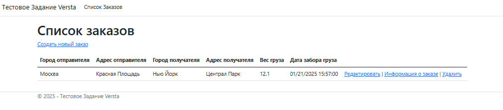
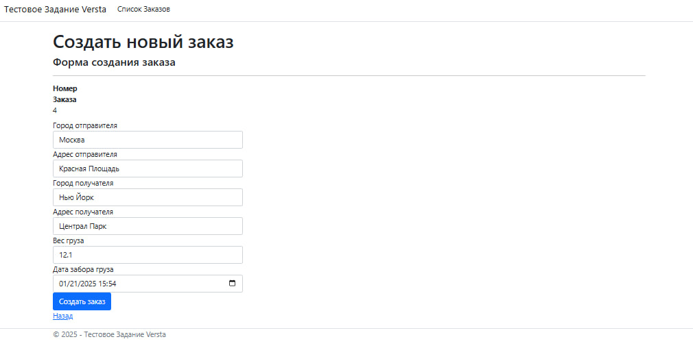
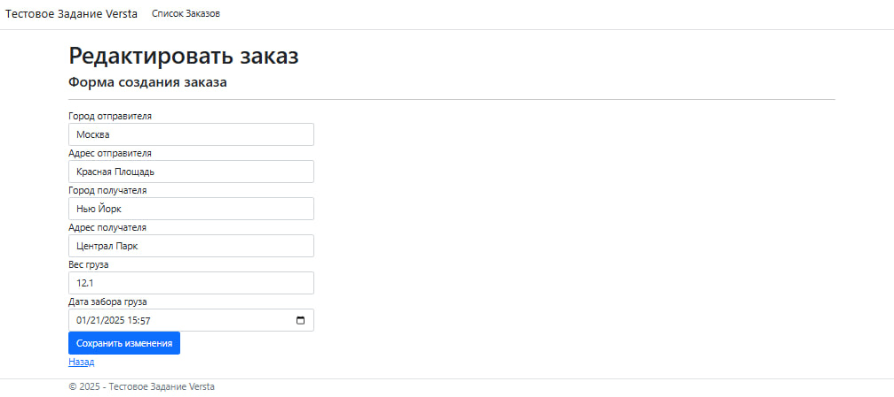
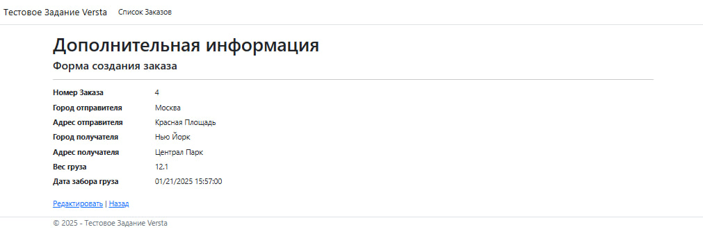
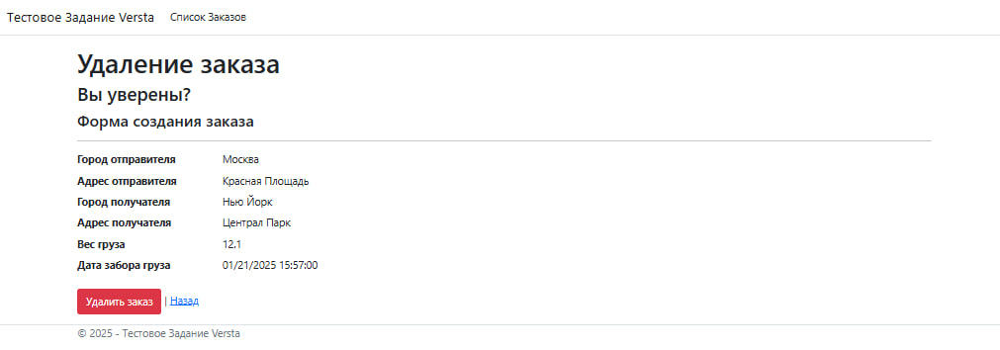

# Тестовое задание для Versta

## Stack

* MS SQL
* ASP.NET Core
* Entity Framework Core

## Установка

### Зависимости
Убедитесь, что на вашем компьютере установлены [ASP.NET Core Runtime](https://dotnet.microsoft.com/en-us/download/dotnet/8.0) 
(Рекомендуется Hosting Bundle) и [SQL Server](https://www.microsoft.com/en-us/sql-server/sql-server-downloads), а версии пакетного 
менеджера и пакета Entity Framework являются актуальными. После этого можно переходить к началу установки

### Build
1. Запустите проект в **Visual Studio**, открыв файл решения `Versta.sln`
2. Запустите сборку модуля **DatabaseWorker**, нажав правой кнопкой мыши по названию модуля и выбрав соответсвующий пункт в контекстом меню
3. Откройте файл `appsettings.json` и измените значения в поле **Connection** на соответсвующее названию вашего сервера
4. Откройте консоль **Package Manager** выбрав в верхнем контекстном меню пункт **View** → **Other Windows** → **Package Manager Console**
5. Введите команду `Update-Database` в открытом окне консоли
6. Запустите сборку модуля Versta
7. Запустите проект, в новом окне браузера откроется готовое решение

## Скриншоты

\
*Список текущих заказов и главная страница*

\
*Форма создания нового заказа*

\
*Форма редактирования заказа*

\
*Страница с информацией о заказе*

\
*Форма удаления заказа*

